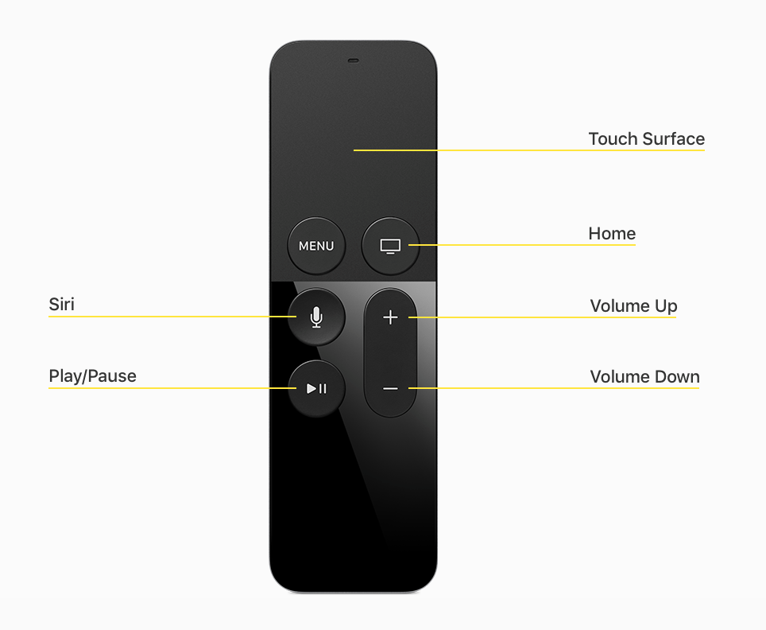

# Apple TV

[**General**](#general)

[**Frameworks**](#frameworks)

[**Human Interface Guidelines**](#human-interface-guidelines)

[**Remote and interactions**](#remote-and-interactions)

[**Navigation**](#navigation)

[**Icons and images**](#icons-and-images)

[**Visual Design**](#visual-design)

[**Layout**](#layout)

[**Interface elements**](#interface-elements)

[**Resources**](#resources)

# General
- [ ] tvOS and iOS work together.

## Differences from iOS
- [ ] http://ericasadun.com/2015/11/08/tvos-and-ios-some-thoughts/2/

## Fonts
- [ ] http://ericasadun.com/2015/11/08/available-built-in-tvos-fonts/

# Frameworks
- [ ] Metal
- [ ] UIKit
- [ ] CloudKit
- [ ] Game Center

# [Human Interface Guidelines](https://developer.apple.com/tvos/human-interface-guidelines/)
- [ ] Leverage touch in a way that connects people with your content in a delightful and engaging manner.
- [ ] Use layout grids, movement, and transparency to provide context.
- [ ] Make it crystal clear at a distance when something is in focus.
- [ ] Edge-to-edge artwork.
- [ ] In iOS, the user sees and touches the same device. On Apple TV, the user sees the screen across the room while touching the remote. Look for opportunities to help people feel connected to your app through their remote, even though they’re sitting at a distance.
- [ ] it’s always clear what’s in focus and what happens as a result of actions taken on the remote.
- [ ] Consider how your app can appeal to a group.
- [ ] Consider what happens if the user is a different person each time your app is launched.
- [ ] The top shelf is a content showcase area above the top row of apps on the Apple TV Home screen. The user can decide which apps are in the top row. When one of these apps is brought into focus, the top shelf displays featured content specific to that app.
- [ ] Top shelf only available to apps on top row.
- [ ] Pressing the Play/Pause button on the remote while a show is in focus [on top shelf] begins media playback for the show.
- [ ] Image layering to support the parallax effect is a requirement for your app icon and is supported for dynamic top shelf content on the Home screen.
- [ ] Image layering is strongly encouraged anywhere focusable image-based content resides in your app.

# [Remote and interactions](https://developer.apple.com/tvos/human-interface-guidelines/remote-and-interaction/)

- [ ] accelerometer
- [ ] gyroscope
- [ ] touch surface
- [ ] swipe —> moves focus up, down, left, right between items. Movement starts fast and slows down (like iOS swipe).
- [ ] tap —> navigates through collection one-by-one. Tapping different regions [of the touch surface] navigates directionally [up, down, left right]. Can be used for hidden controls (?), only use when intuitive / discoverable.
- [ ] click —> activates a control or selects an item. Click+Hold for context-specific actions (eg. edit mode).
- [ ] Differentiate between click and tap.
- [ ] Avoid triggering unintentional taps (?) —> Keep in mind user can rest thumb, pick it up, move it around, hand it to someone.
- [ ] Click for pressing buttons, confirm selection, initiating action (in gameplay).
- [ ] Tap navigation / showing aditional information.
- [ ] Define new gestures only when it makes sense —> Should be an experience.
- [ ] Confirm game controller connections.
- [ ] Must be able to use Siri Remote.

- [ ] Menu: previous screen, home screen when at top level (main app screen).
- [ ] ALWAYS enable all buttons —> Esp. play/pause… feel broken otherwise.

# [Navigation](https://developer.apple.com/tvos/human-interface-guidelines/navigation-and-focus/)
- [ ] Standard interface elements: tab bars, table views, collection views, split views and segmented controls.
- [ ] Simplify information structure and organise / optimise for minimum number of screens / taps / clicks.
- [ ] Move through focusable items with as few gestures as possible.
- [ ] Avoid too many gestures; user needs to focus before action.
- [ ] No back button > menu button can be used for that. —> DO use a cancel button when appropriate (eg. when only visible buttons purchase / delete / …).
- [ ] Single screen over multiple —> gestures can move quickly through lots of content.
- [ ] Horizontal swiping > vertical swiping —> easier and more natural.
- [ ] Full-screen elements should use direct manipulation —> gestures move objects, not focus.
- [ ] UIKit provides focus automatically.
- [ ] Own focus model —> should stand out (eg. image + title on focus, without title on unfocussed).


- [ ] Use parallax to enhance perception of connection to content; reinforce focus.
- [ ] Focusable items should be of comfortable sizes (read: not too small, use spacing).
- [ ] Supply assets for focussed items.
- [ ] Keep in mind both unfocussed as well as focussed view.
- [ ] Revert animation / state when unfocussing.
- [ ] DON’T DISPLAY A CURSOR(!)

# [Icons and images](https://developer.apple.com/tvos/human-interface-guidelines/icons-and-images/)
- [ ] Always provide images at the size required by the UI. —> Not too small, not too big (as downscaling takes time)
- [ ] All images are @1x.

- [ ] App icon should have a single focus point.
- [ ] Keep the app icon background simple.
- [ ] Use words only when essential —> App name appears below icon
- [ ] Don’t use a screenshot as an app icon.
- [ ] Icon should be square, system applies mask
- [ ] App icon must be [layered](https://developer.apple.com/tvos/human-interface-guidelines/icons-and-images/#layered-images).
- [ ] Logo should be separate from background.
- [ ] Text should be on front, so it’s not hidden while applying parallax effect.
- [ ] MUST supply small and large icon.
- [ ] Large icon should ‘just’ be downscaled, no different icons.


So… 13 > 15


- [ ] At least one (static) top shelf image must be supplied. (1920px by 720px)
- [ ] Deep link top shelf images in application.
- [ ] Use play/pause button to start playing top shelf ‘content’ (if applicable).
- [ ] Consider implementing dynamic and more captivating, dynamic imagery as top shelf image (eg. highest rated content / newest content / “Handoff”?).
- [ ] Static image is used as fallback; is not focusable (so highlight the brand).
- [ ] Personalise dynamic content; user puts app in top row on purpose, is famillar with your app (eg. resume media playback / gameplay / “Handoff”?).
- [ ] DON’T show adds on top shelf —> At least focus on content, not price.
- [ ] Can use multilayer images.
- [ ] Can use dynamic content layout.

## Sectioned content row


- [ ] Use eg. recently viewed, new content, favorites.
- [ ] Is focusable.
- [ ] Always provide enough content for complete row.
- [ ] Always provide at least one label (see “Top Movies”)
- [ ] Various aspect ratios:
- [ ] Combining is possible, but keep in mind automatic scaling up to match height.


## Scrolling inset banner


- [ ] Automatically scrolls (left to right) on timer until focus.
- [ ] Loops when final image is reached.
- [ ] Focus effect works on these images.
- [ ] Minimum of 3 images recommended to provide comfortable scrolling.
- [ ] No label, so add text to image when needed. Keep layers in mind, so text should be on top for legibility.


## Game center images
- [ ] Achievement icons —> Not focusable.
- [ ] Dashboard artwork (which is at top of game’s dashboard) —> Not focusable.
- [ ] Leaderboard artwork —> Focusable


## Layered images
- [ ] Two to five distinct layers.
- [ ] Higher levels elevate and scale, overlapping lower levels further back and producing a 3D effect.
- [ ] MUST for app icons, STRONGLY RECOMMENDED for focusable content (including top shelf).
- [ ] Foreground layers: prominent elements (eg. characters, text).
- [ ] Middle layers: secondary content and effects (eg. shadow).
- [ ] Background layers: opaque backdrops —> MUST be opaque.
- [ ] KISS (keep it simple, stupid)
- [ ] Use save zone to make sure primary content is always visible.


- [ ] Recommended for calculating sizing for a layered image (based on unfocussed image):


- [ ] Layers made of PNG’s create LSR files automatically.
- [ ] Parallax Exporter Photoshop Plug-in can be used to create LSR files.

## Launch Image
- [ ] MUST be added to an app. (1920px by 1080px)
- [ ] Static.
- [ ] As on iOS, used to give perception of faster loading speed.
- [ ] … so mimic first app screen where possible.
- [ ] Avoid using text in launch image (as it CAN’T be localized).
- [ ] SHOULDN’T draw attention to app launching experience.
- [ ] NO ADS / SPLASH SCREEN —> Exception: when branding is part of first screen.

# [Visual Design](https://developer.apple.com/tvos/human-interface-guidelines/visual-design/)
## Animation
- [ ] Built into UIKit.
- [ ] Avoid using animation without user interaction.
- [ ] Carefully consider animation; don’t use it for the sake of using it.
- [ ] Avoid animations with excessive movement, as they can be annoying on a TV.
- [ ] Strive for realism and credibility: content is lightweight; don’t animate it like it isn’t (eg. no bouncing, springing).

## Branding
- [ ] Branding through font / color / image > branding with assets.
- [ ] Don’t overdo branding.
- [ ] Use colors from your app icon throughout the interface.
- [ ] Consider using a custom tint or font, or subtly customizing the background.
- [ ] Avoid displaying a logo throughout the app unless necessary for providing context.

## Color
- [ ] Enhances content.
- [ ] Draws people into content (instead of around it).
- [ ] Colors should complement app logo.
- [ ] Use sRGB color space.
- [ ] Test on TV (multiple TV’s if possible).
- [ ] Test with multiple display levels (eg. brightness, contrast).
- [ ] Muted colors > satured colors —> can look overwhelming.
- [ ] Be aware of color blindness.
- [ ] Focus by scaling and animation, color is secondary.

## Content
- [ ] Respect [parental controls](https://developer.apple.com/library/prerelease/ios/documentation/iPhone/Conceptual/iPhoneOSProgrammingGuide/StrategiesforImplementingYourApp/StrategiesforImplementingYourApp.html#//apple_ref/doc/uid/TP40007072-CH5-SW42).
- [ ] Create for multiple people (at once).

# Layout
- [ ] Keep primary content away from the edges of the screen.


- [ ] Include padding / spacing between (focusable) elements.
- [ ] Hint at offscreen elements by partially showing them when applicable.
- [ ] Use [layout templates](https://developer.apple.com/tvos/human-interface-guidelines/visual-design/#layout-templates) where possible.
- [ ] Use grids where possible.


- [ ] Automatically determined when using collection view flow element (based on width and spacing).
- [ ] Again, keep the safe zone in mind. Should only be used for hinting content.
- [ ] Include additional spacing when using titles.
- [ ] Use consistent spacing.
- [ ] Offscreen content should be symmetrical on both sides of the screen (either up/down(?), left/right).

## Layout templates
- [ ] Can be customized, but avoid when not needed.
- [ ] When customizing, keep an eye on the original template. Consider using another when it changes too much, or build a custom one.
- [ ] Built with TVML.
- [ ] Please view all [layout templates](https://developer.apple.com/tvos/human-interface-guidelines/visual-design/#layout-templates).

## Text
- [ ] Minimize text —> Show, don’t tell (eg. images, animation).
- [ ] < 40pt SF Text, > 40pt SF Display
- [ ] Support accessibility features (eg. bold text) when using custom fonts.


## Video
- [ ] Use the system video player to provide a consistent viewing experience.
- [ ] Only create a custom one when truly necessary.
- [ ] Avoid overlays, such as logos (an unobtrusive logo or countdown can be used, but content is key).
- [ ] Interactive elements should be shown with a delay of at least 0.5 seconds. Playback should continue when dismissed.
- [ ] Customize a video’s information with image, title, description, …

# [Interface elements](https://developer.apple.com/tvos/human-interface-guidelines/ui-elements/)
## Tab bar
- [ ] Used to logically organize content at the top level of your app.
- [ ] Use badges when applicable (number or excl. mark).
- [ ] Keep badging manageable.
- [ ] Keep the number of tabs manageable.
- [ ] All tabs should fit onscreen.
- [ ] Use short tab-titles (nouns, verbs), no images.
- [ ] Apply tint / adjust opacity to match your app’s color scheme / style.

## Tableview
- [ ] Mostly used in a split view.
- [ ] Adjust table width according to context.
- [ ] Keep tables easily scannable.
- [ ] Quickly show content, load complex content (such as images) only when needed.
- [ ] Show progress bar/activity indicator when loading.
- [ ] Cells can have predefined styles.
- [ ] Keep focused state in mind —> applies rounding mask, becomes larger.
- [ ] DON’T offer edit / delete option unless necessary, as it is a tedious task on Apple TV.

## Collectionview
- [ ] Best for image based content (that varies in size).
- [ ] Use padding to ease focussing and prevent clipping.
- [ ] Consider a tableview instead when using text.
- [ ] Consider using a template (https://developer.apple.com/tvos/human-interface-guidelines/visual-design/#layout-templates)

## Splitview
- [ ] Defaults to ⅓ primary, ⅔ secondary.
- [ ] Make sure it doesn’t look unbalanced.
- [ ] Always keep highlighting the primary pane, also when browsing the secondary pane.
- [ ] Use one title for the whole view.
- [ ] Place the title above the primary view only when the secondary pane needs it’s room.

## Text
- [ ] Minimize text entry.
- [ ] Physical keyboard CAN be connected.
- [ ] Remote app(?).
- [ ] Always use a placeholder.
- [ ] Use (optional) accessory view when appropriate.
- [ ] Use secure text field when appropriate.
- [ ] Use keyboard types.

## Search
- [ ] Provide recent searches before the users starts typing.
- [ ] Simplify results —> provide custom view when needed, present smaller set of results.
- [ ] Implement a scope bar when applicable.

## Buttons
- [ ] Use an icon or title, not both (when possible).
- [ ] Label and confirm destructive actions (eg. deleting).
- [ ] No back buttons.
- [ ] Icons should be simple and recognizable.
- [ ] Put additional text below an icon button if necessary.
- [ ] Use a verb or verb phase as a title where possible.
- [ ] Capitalize every word of a button title except articles, coordinating conjunctions, and prepositions of four letters or less.
- [ ] Text should be short and to the point.
- [ ] Text can be truncated when too long.

## Navigation bar
- [ ] Can be used instead of a tab bar where applicable.

## Page controls
- [ ] Informational only, non-interactive.
- [ ] Use for collections of full-screen pages.
- [ ] Avoid displaying too many pages.
- [ ] If many are needed, consider a grid, enabling non-sequential navigation.

## Indicators
- [ ] Use an indicator when loading at all times.
- [ ] Disappears when action is complete.
- [ ] Progress bar (when quantifiable) > activity indicator
- [ ] For an activity indicator, provide a text label (which is not vague like ‘loading’ or ‘authenticating’, but contextual).

## Segmented controls
- [ ] Use when displaying multiple views.
- [ ] Options should be closely related but mutually exclusive (eg. playlist and albums).
- [ ] Selected on focus, not click.
- [ ] For the above reason, don’t put other focusable elements near to avoid accidental triggering (or focussing on other elements).
- [ ] For content filtering, consider a split view.
- [ ] Limit sections to < 7.
- [ ] All segments are equal width, so try making the content inside ± equal, too.
- [ ] Use text or icons, don’t mix.

## Alerts
- [ ] Convey important information.
- [ ] Title is required and should be meaningful (read: multiword).
- [ ] Message is optional.
- [ ] One or more buttons.
- [ ] Appearance can’t be customized.
- [ ] Minimize the use of alerts.
- [ ] Try to avoid a message by making the title as meaningful as possible.
- [ ] Messages, when needed, should be short, though using complete sentences.
- [ ] Use two button alerts where possible. Single buttons give no control, three or more create complexity.
- [ ] Button title should be one or two words that describe the result of the action (eg. ‘Cancel’, ‘View All’, ‘Reply’, ‘Ignore’).
- [ ] Avoid ‘Yes’ and ‘No’, use ‘OK’ for acceptance.
- [ ] Cancel buttons must be obvious, like ‘Cancel’ or ‘Dismiss’.
- [ ] Set a button as destructive when applicable (eg. deleting or hiding content). Do NOT use for other things (eg. buying, renting).
- [ ] ‘Menu’-button on Siri Remote should perform cancel.

# [Resources](https://developer.apple.com/tvos/human-interface-guidelines/resources/)
